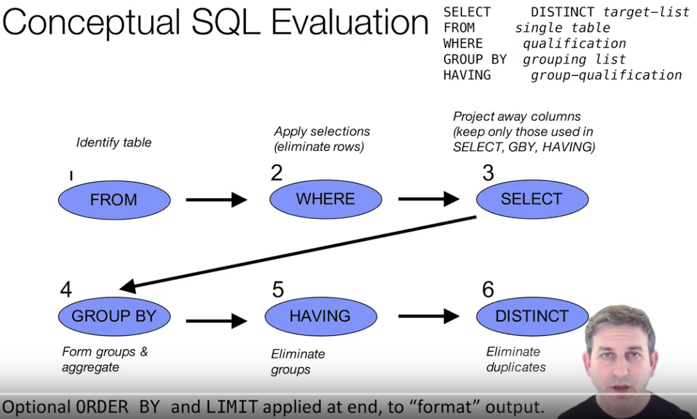

# Quick Reference

## Order of Operations



```
SELECT- FROM- WHERE- GROUP BY- HAVING-ORDER BY
```

## Concepts

conceptually a SQL table is a set of tuples $$ \{(x,y,z) | X \times Y \times Z\} $$  
where  x :: X , we will omit the type space, X,Y,Z with ...  
which  is also known as a product


$$ NULL \in X\ for\ any\ Type\ X$$ 


### Join

$$\{(a,b)| A \times B\} \times \{(b,c)| B \times C\} \ where\ b_1 ==b_2$$   
results : $$ \{(a,b_1,b_2,c) | ...b_1 == b_2  \}$$  
The "..." is simply the type space A x B x B x C.

* Example
  * $$\{(a,b)| faculty \times ID\} \times \{(b,c)| ID \times Boss\}\  where\ b_1 ==b_2$$
  * example result tuples of the inner join table

    * \('cloth',24,24,'bob'\)
    * \(NULL,13,13,NULL\)


The type space can have a mixture of NULLS


