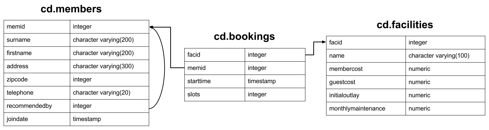

# Inner Join

### INNER JOIN 



The SELECT also uses the aliases. We create a SQL JOIN statement in-&gt;out, from the FROM ..WHERE to SELECT.

```bash
#Step 1 Create the JOIN statement, alias is some variable name you make up
FROM                        
    firstTable aliasA
    INNER JOIN 
    sndTable aliasB
WHERE
    aliasA.prop ...
    ... 
#Step 2 Create Add the Select statement
SELECT aliasA.prop as blah, aliasB.prop as bleh
FROM
    ...
```


```sql
select bks.starttime as start, facs.name as name
	from 
		cd.facilities facs
		inner join cd.bookings bks
			on facs.facid = bks.facid
	where 
		facs.name in ('Tennis Court 2','Tennis Court 1') and
		bks.starttime >= '2012-09-21' and
		bks.starttime < '2012-09-22'
order by bks.starttime; 
```



 we need to link cd.bookings and cd.facilities, and constrain to specific day\(cd.bookings\) and facility\(cd.facilities\). 


### INNER JOIN SELF - TRANSITIVE RELATION


```sql
select distinct recs.firstname as firstname, recs.surname as surname
	from 
		cd.members mems
		inner join cd.members recs
			on recs.memid = mems.recommendedby
order by surname, firstname; 
```


#### Deeper Transitive relation


```text
Herietta  --recBY-> Matthew  --recBY-> Gerald --recBY-> Darren
Ramnaresh --recBY-> Florence --recBY-> Ponder --recBY-> Burton
Douglas   --recBy-> David    --recBY-> Janice --recBY-> Darren
```


```sql
select distinct recs.firstname as rootrecommender, abc2.firstname as thirdhoprecommended
	from 
		
		(cd.members mems
		inner join cd.members recs
			on recs.memid = mems.recommendedby)  --first hop
			inner join cd.members abc
				on mems.memid = abc.recommendedby --second hop
					inner join cd.members abc2
						on abc.memid = abc2.recommendedby --third hop
;    
--using SELECT, we can only choose information about those with
--level 3 nested recommendations.
--BUT THAT also means out of level 3 we can choose 1,2,3 recommendations
```

